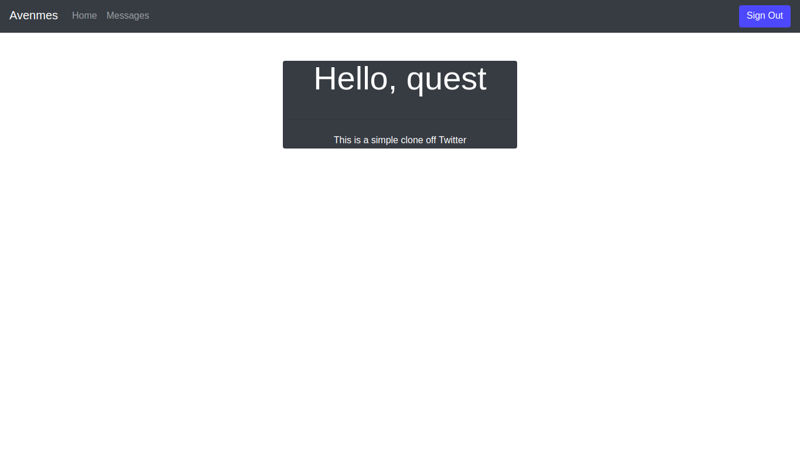
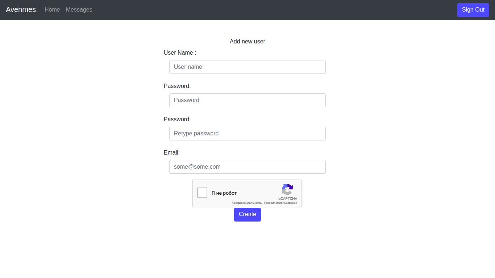
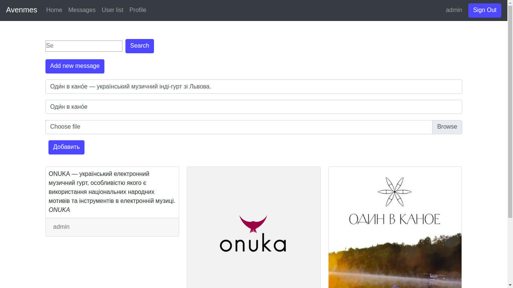

# Avenmes
This is a simple clone off Twitter

Technologies:
Framework: Spring (boot, data, security, mail)
Database: JDBC, flyway, JPA, Hibernate
WEB: Freemarker, HTML, Bootstrap

Home

Sign In

Registration

Messages

User list

User editor

Profile

